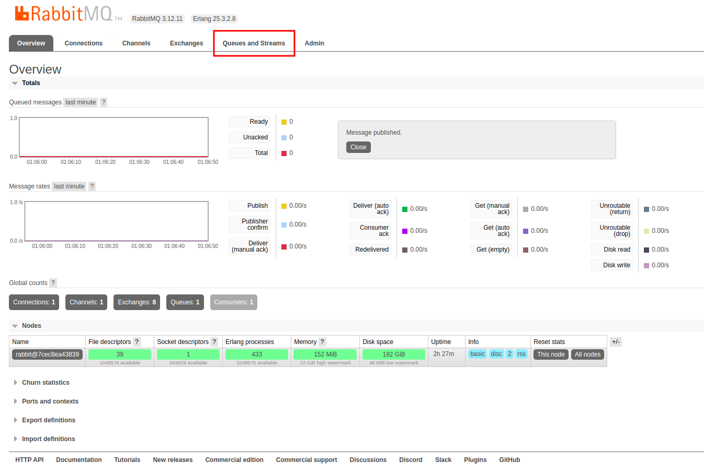

# Commerce
_API REST para gerenciamento de pedidos de compra._

## Como iniciar a aplicação

### Docker
É necessário executar o `docker-compose.yml` que se encontra na pasta raiz do projeto.

Você pode fazer isso via linha de comando por meio do `docker-compose up -d`.

### Banco de dados
É possível acessar o banco de dados através de um DBMS, como Dbeaver ou DataGrip, utilizando a conexão abaixo:

<b>Credenciais de acesso</b> 
Host: localhost 
Port: 5432  
Database: commerce  
Username: admin  
Password: admin  

### Mensageria
É possível acessar o console do RabbitMQ através do endereço: http://localhost:15672

<b>Credenciais de acesso</b> 
Username: admin  
Password: admin  

#### Publicando uma mensagem na fila "order.save" para consumo da aplicação
